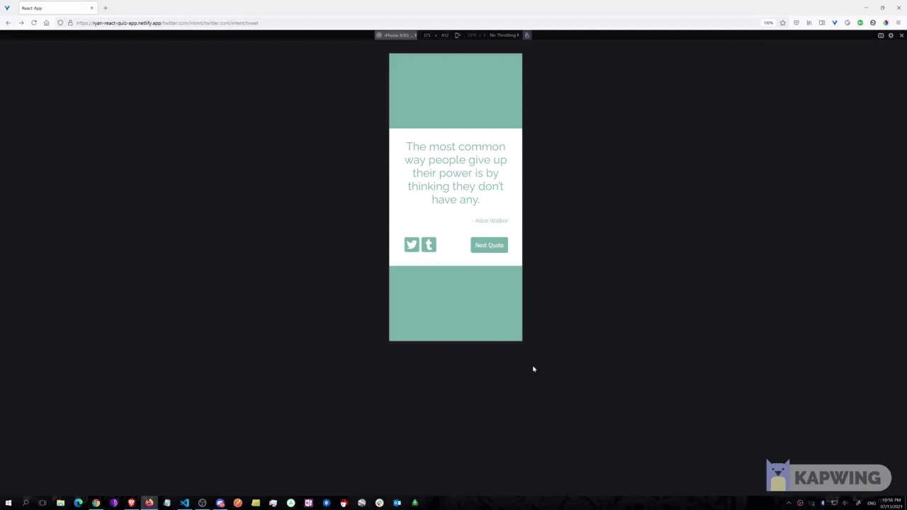

# Random Quote Machne

  
  

 

**The Random Quote Machine** shows you a motivative random quote and an author along with a various background color.  

## **Table of Contents**

- [Features](#features)
- [Development](#development)
  - [Technologies](#technologies)
- [Installation or Getting Started](#installation-or-getting-started)
- [Production Deployment](#production-deployment)
- [Author](#authors)

 

## **Features**

- Mobile Responsive
- User-friendly design

 

## **Development**

### **Technologies**

| Languages     | Purpose                         |
| :------------ | :------------------------------ |
| [Javscript]() | Used as a main language         |
| [CSS]()       | For Global Style                |
| [HTML]()      | Set a baseframe for the project |

 

### **Library**

| Library & Framework   | Purpose                     |
| :-------------------- | :-------------------------- |
| [React]()             | For UI & UX                 |
| [Material-UI]()       | For Social Media Icons Link |
| [styled-Components]() | Stylish the project         |
| [React-Icons]()       | To Use Social Media Icons   |

 

### **API used for the project**

| API              | Address                                                                                                                                |
| :--------------- | :------------------------------------------------------------------------------------------------------------------------------------- |
| [Random Quote]() | https://gist.githubusercontent.com/camperbot/5a022b72e96c4c9585c32bf6a75f62d9/raw/e3c6895ce42069f0ee7e991229064f167fe8ccdc/quotes.json |

 

## **Installation or Getting Started**

Either downloading or doing git clone

    git clone https://github.com/ryanbest99/RANDOM-QUOTE-MACHINE

Open browser and go to the location of index.html

 

## **Production Deployment**

Deployed to Netlify : Click [here](https://ryan-react-quiz-app.netlify.app/)

 

## **Authors**

- **Ryan Park**: Front-End Developer [[github](https://github.com/ryanbest99)]

# License & Copyright

Licensed under the [MIT License](LICENSE).
